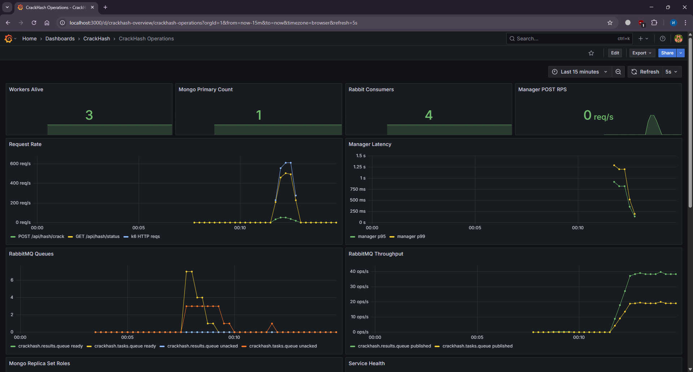
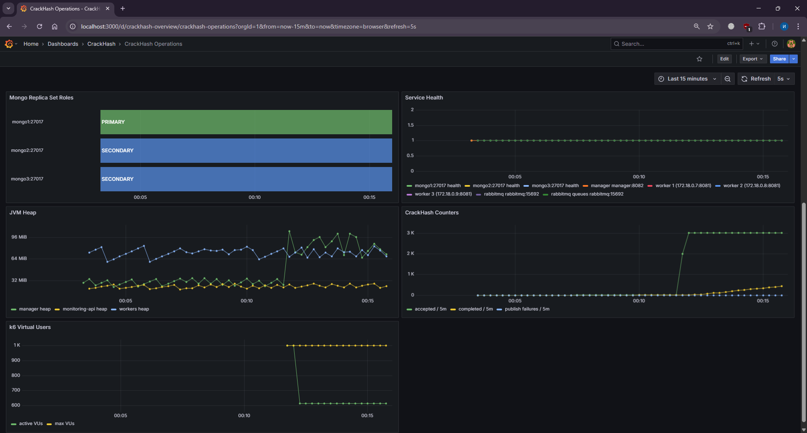

# CrackHash

Проект для курса "Распределенные информационные системы" (НГУ ФИТ 4 курс, 2026): распределенная система перебора MD5-хэша. Текущая версия реализует требования Task 2 (см. [`docs/TASKS.md`](docs/TASKS.md)): отказоустойчивость за счет MongoDB replica set, RabbitMQ, durable queues, MongoDB outbox и идемпотентной обработки результатов.

## Что демонстрирует проект

- Проектирование распределенной системы `manager -> RabbitMQ -> workers -> RabbitMQ -> manager`.
- Гарантированное сохранение принятой задачи: MongoDB replica set, `writeConcern=majority`, outbox-повторы.
- Надежную доставку сообщений: durable exchanges/queues, persistent messages, publisher confirms, manual ack/nack.
- Горизонтальное масштабирование worker-сервисов через Docker Compose `--scale worker=N`.
- Наблюдаемость: Spring Boot Actuator, Prometheus, Grafana dashboard, k6 load testing.
- Web UI на React/Vite для запуска задач и просмотра состояния обработки.

## Стек

- **Backend:** Java 11, Spring Boot, Spring AMQP, Spring Data MongoDB, Actuator, Micrometer.
- **Frontend:** React 18, TypeScript, Vite, SCSS, Axios, Jest + React Testing Library.
- **Messaging:** RabbitMQ direct exchanges, durable queues, persistent messages.
- **Storage:** MongoDB 7 replica set: one primary and two secondary nodes.
- **Observability:** Prometheus, Grafana provisioning, RabbitMQ Prometheus plugin.
- **Load testing:** k6 with Prometheus remote write.
- **Runtime:** Docker Compose, PowerShell helper script.

## Архитектура

Подробная схема потоков, очередей, мониторинга и сценариев отказа вынесена в [`docs/ARCHITECTURE.md`](docs/ARCHITECTURE.md). Markdown-версия учебных заданий лежит в [`docs/TASKS.md`](docs/TASKS.md).

Система состоит из следующих компонентов:

- **Manager**: Spring Boot REST API для клиента. Сохраняет запрос и части задачи в MongoDB, публикует части в RabbitMQ через outbox-механику, принимает результаты воркеров из отдельной очереди.
- **Worker**: Spring Boot вычислительный сервис. Берет задачи из RabbitMQ, перебирает свою часть пространства слов и публикует результат обратно в RabbitMQ.
- **MongoDB replica set**: три data-bearing ноды `mongo1`, `mongo2`, `mongo3`. Manager использует `writeConcern=majority`, поэтому клиент получает `requestId` только после надежного сохранения данных.
- **RabbitMQ**: две durable direct-схемы: очередь задач и очередь результатов. Сообщения отправляются как persistent JSON, publisher confirms включены.
- **Client**: React/TypeScript/Vite UI для отправки запросов, polling статуса и просмотра мониторинга. Подробнее: [`client/README.md`](client/README.md).
- **Monitoring API**: отдельный read-only Spring Boot сервис на `:8083`. Читает состояние задач напрямую из MongoDB replica set, поэтому вкладка Monitoring не зависит от доступности manager.
- **Prometheus + Grafana**: сбор и визуализация метрик manager, workers, RabbitMQ и k6.
- **k6**: основной инструмент нагрузочного тестирования.

Внешний API клиента:

```http
POST /api/hash/crack
GET /api/hash/status?requestId=...
```

Внутреннее HTTP-взаимодействие manager/worker из Task 1 заменено на RabbitMQ.

## Скриншоты

| Основной экран взлома, светлая тема | Экран мониторинга, темная тема |
|---|---|
|  |  |

| Обзорный dashboard Grafana, часть 1 |
|---|
|  |

| Обзорный dashboard Grafana, часть 2 |
|---|
|  |

| Результаты нагрузочного теста k6 |
|---|
|  |

Grafana dashboard `CrackHash Operations` provisioned автоматически и показывает worker health, MongoDB replica-set roles, RabbitMQ queue depth, manager RPS/latency, JVM heap, бизнес-счетчики и k6 virtual users. Конфигурация dashboard находится в [`monitoring/grafana/dashboards/crackhash-overview.json`](monitoring/grafana/dashboards/crackhash-overview.json).

## Конфигурация

Основные параметры лежат в локальном файле `.env`. Для публикации в Git используется шаблон `.env.example`:

```bash
cp .env.example .env
```

PowerShell:

```powershell
Copy-Item .env.example .env
```

Пример параметров:

```env
WORKER_REPLICAS=3
TASK_PARTITION_COUNT=10
TASK_TIMEOUT_MS=300000
RABBITMQ_PREFETCH=1
MANAGER_PORT=8082
MONITORING_API_PORT=8083
WORKER_PORT=8081
MONGO_REPLICA_SET=rs0
RABBITMQ_DEFAULT_USER=guest
RABBITMQ_DEFAULT_PASS=guest
```

Главные параметры:

- `WORKER_REPLICAS`: сколько worker-контейнеров поднять. По умолчанию 3.
- `TASK_PARTITION_COUNT`: на сколько частей manager делит пространство слов для одного запроса.
- `RABBITMQ_PREFETCH`: сколько unacked-задач RabbitMQ может отдать одному воркеру. Значение 1 не дает воркеру забрать лишнюю тяжелую работу в память.
- `TASK_TIMEOUT_MS`: совместимый параметр из Task 1; в Task 2 задачи не переводятся в `ERROR` только из-за долгого ожидания очереди/воркера, чтобы не ломать гарантию доставки.

Количество воркеров и количество частей задачи можно менять независимо. Если увеличить `WORKER_REPLICAS`, новые воркеры начнут слушать ту же очередь. Если увеличить `TASK_PARTITION_COUNT`, одна задача будет дробиться на большее число сообщений.

## Запуск

Обычный запуск всей системы:

```powershell
.\scripts\start.ps1
```

Скрипт читает `.env` и выполняет:

```powershell
docker compose up --build --remove-orphans --scale worker=$env:WORKER_REPLICAS -d
```

Можно запустить вручную:

```bash
docker compose up --build --scale worker=3 -d
```

Адреса:

- Client: http://localhost
- Manager API: http://localhost:8082
- Monitoring API: http://localhost:8083
- RabbitMQ UI: http://localhost:15672 (`guest` / `guest`)
- MongoDB primary доступен с хоста через `localhost:27017`

Остановка:

```bash
docker compose down
```

Полная очистка данных RabbitMQ, MongoDB, Prometheus и Grafana:

```bash
docker compose down -v
```

## Мониторинг

Запуск с Prometheus и Grafana:

```powershell
.\scripts\start.ps1 -Monitoring
```

Или вручную:

```bash
docker compose --profile monitoring up --build --scale worker=3 -d
```

Адреса:

- Prometheus: http://localhost:9090
- Grafana: http://localhost:3000 (`admin` / `admin`)

Grafana автоматически получает Prometheus datasource и dashboard `CrackHash Operations`.

Prometheus собирает:

- `manager:8082/actuator/prometheus`
- `monitoring-api:8083/actuator/prometheus`
- все `worker` instance через Docker discovery; в Grafana они подписываются как `worker N (ip:port)`
- RabbitMQ metrics endpoint `rabbitmq:15692`
- k6-метрики через Prometheus remote write при запуске профиля `loadtest`

## Нагрузочное тестирование

Основной сценарий k6:

```bash
docker compose --profile monitoring --profile loadtest up k6
```

Параметры можно менять через env:

```bash
K6_VUS=50 K6_DURATION=2m docker compose --profile monitoring --profile loadtest up k6
```

k6 отправляет метрики в Prometheus через remote write, после чего их можно смотреть в Grafana. Старое Java-приложение в `load_tests` оставлено как baseline для сравнения с Task 1.

Скриншот результатов: [`screenshots/k6-test-results.png`](screenshots/k6-test-results.png). Он снят для профиля из `.env`: `WORKER_REPLICAS=3`, `TASK_PARTITION_COUNT=10`, `K6_VUS=1000`, `K6_DURATION=30s`, `K6_POLL_STATUS=true`, `K6_MAX_LENGTH=2`, `K6_SLEEP_SECONDS=1`.

Подробнее про k6-сценарий и интерпретацию метрик: [`load_tests/README.md`](load_tests/README.md).

## Статусы запросов

- `QUEUED`: запрос сохранен, части ждут публикации или свободных воркеров.
- `IN_PROGRESS`: хотя бы часть опубликована/обрабатывается.
- `READY`: все уникальные части завершены, `data` содержит найденные слова.
- `ERROR`: запрос не найден или произошла невосстановимая ошибка.

## Отказоустойчивость

Что покрывает реализация:

- **Падение manager**: результаты воркеров остаются в `crackhash.results.queue`; после рестарта manager дочитает их и сохранит в MongoDB.
- **Падение worker**: задача остается unacked в `crackhash.tasks.queue`; RabbitMQ отдаст ее другому воркеру.
- **Падение RabbitMQ**: неопубликованные части остаются в MongoDB со статусом `PENDING_PUBLISH` или `PUBLISH_FAILED`; outbox-планировщик manager переотправит их после восстановления RabbitMQ.
- **Рестарт RabbitMQ**: durable queues и persistent messages сохраняют задачи и результаты.
- **Падение MongoDB primary**: replica set выбирает новый primary; после election manager продолжает работу.
- **Повторная доставка сообщений**: manager идемпотентно обрабатывает результат по `requestId + partNumber`, поэтому дубли не увеличивают счетчик завершенных частей повторно.

## Проверочные сценарии

Остановить manager:

```bash
docker compose stop manager
docker compose start manager
```

Остановить worker во время обработки:

```bash
docker compose stop crackhash-worker-1
```

При масштабируемом сервисе имя контейнера может отличаться; посмотреть имена можно через:

```bash
docker compose ps
```

Остановить RabbitMQ:

```bash
docker compose stop rabbitmq
docker compose start rabbitmq
```

Остановить текущий MongoDB primary:

```bash
docker compose exec mongo1 mongosh --quiet --eval "rs.status().members.map(m => ({name: m.name, stateStr: m.stateStr}))"
docker compose stop mongo1
```

Если primary был не `mongo1`, остановить соответствующий сервис. Через несколько секунд replica set выберет новый primary.

## Разработка

Структура репозитория:

```text
manager/          Spring Boot API менеджера, состояние в MongoDB, outbox, listener результатов RabbitMQ
worker/           Spring Boot worker, listener задач RabbitMQ, перебор MD5
monitoring-api/   API только для чтения для вкладки Monitoring
client/           React/TypeScript/Vite интерфейс; подробнее в client/README.md
monitoring/       конфигурация Prometheus и Grafana
load_tests/       сценарий k6 и старый Java baseline для нагрузочного тестирования
docs/             архитектура, команды для MongoDB, условия заданий
scripts/          вспомогательные PowerShell-скрипты запуска
```

Сборка manager:

```bash
cd manager
./gradlew build
```

Сборка worker:

```bash
cd worker
./gradlew build
```

Сборка client:

```bash
cd client
npm run build
```

Проверки frontend-кода:

```bash
cd client
npm run lint
npm run typecheck
npm run test
```

В коде поясняющие комментарии добавляются на русском языке в местах с неочевидной логикой: RabbitMQ ack/nack, outbox-повторы, MongoDB transaction/majority semantics и обработка дублей.
