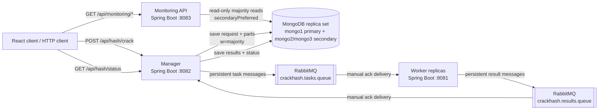
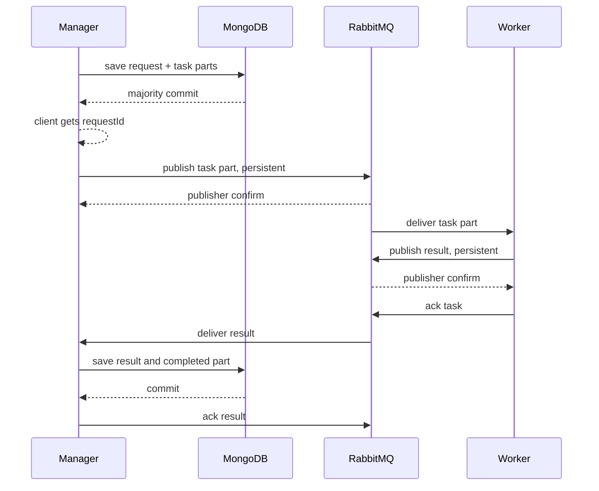
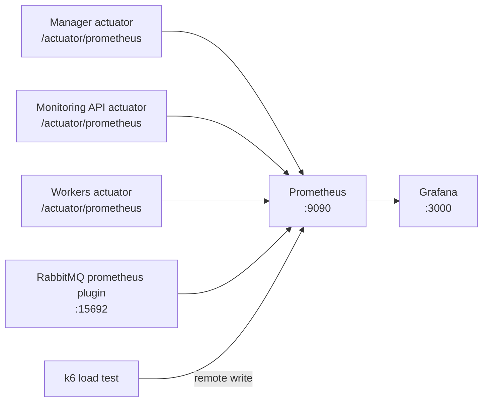

# Архитектура Task 2

Этот документ коротко объясняет, как устроена отказоустойчивая версия CrackHash: где хранятся данные, как работают очереди RabbitMQ, как воркеры получают задачи и как система мониторится.

Практические команды для просмотра данных в MongoDB вынесены в [`MONGODB_INSPECTION.md`](MONGODB_INSPECTION.md).

## Общая схема

## Поток обработки запроса

1. Клиент отправляет `POST /api/hash/crack` с `hash` и `maxLength`.
2. `ManagerService.createCrackTask()` создает `requestId`, основной документ `crack_requests` и N документов `crack_task_parts`.
3. MongoDB подключена как replica set с `w=majority`, поэтому ответ клиенту считается успешным только после надежного сохранения и репликации.
4. Части задачи получают статус `PENDING_PUBLISH`; это outbox, то есть локальная очередь manager в MongoDB.
5. Scheduler `publishPendingParts()` каждые 2 секунды публикует `PENDING_PUBLISH` и `PUBLISH_FAILED` части в `crackhash.tasks.queue`.
6. Воркер получает одну часть, перебирает только свой диапазон слов и публикует результат в `crackhash.results.queue`.
7. Manager читает результат, сохраняет найденные слова, помечает часть `COMPLETED` и переводит весь запрос в `READY`, когда завершены все части.

## Очереди RabbitMQ

В системе две независимые durable direct-схемы:

| Назначение | Exchange | Queue | Routing key | Кто пишет | Кто читает |
|---|---|---|---|---|---|
| Части задач | `crackhash.tasks.exchange` | `crackhash.tasks.queue` | `crackhash.task` | Manager | Workers |
| Результаты | `crackhash.results.exchange` | `crackhash.results.queue` | `crackhash.result` | Workers | Manager |

Важные настройки:

- exchange и queue создаются как `durable`;
- сообщения отправляются с `MessageDeliveryMode.PERSISTENT`;
- publisher confirms включены через `publisher-confirm-type: correlated`;
- `publisher-returns: true` и `mandatory=true` помогают поймать случай, когда сообщение не попало ни в одну очередь из-за routing key/binding;
- ack ручной: manager и worker подтверждают сообщение только после надежного следующего шага.

`correlated` confirms работают через объект `CorrelationData`, который передается в `RabbitTemplate.convertAndSend(...)` вместе с сообщением. Для задач manager кладет в correlation id идентификатор части `requestId:partNumber`, а worker для событий результата использует `requestId:partNumber:attemptId:eventType`. Когда RabbitMQ принимает persistent message в exchange и подтверждает публикацию, Spring AMQP завершает `correlationData.getFuture()` broker ack/nack-ом именно для этой публикации.

В коде manager ждет confirm до 5 секунд. Если broker вернул `ack`, часть можно пометить в MongoDB как `PUBLISHED`. Если пришел `nack`, confirm не пришел вовремя или публикация упала, часть остается в outbox со статусом `PUBLISH_FAILED`, увеличивается `publishAttempts`, а scheduler попробует отправить ее снова. Worker использует ту же схему перед ack исходной задачи: сначала публикует `STARTED`/`COMPLETED`/`FAILED` в очередь результатов и дожидается confirm, затем подтверждает исходное сообщение из `crackhash.tasks.queue`.

## Как работает отказоустойчивость

Что происходит при отказах:

- **Падает manager.** Результаты воркеров остаются в `crackhash.results.queue`. После рестарта manager дочитает их и сохранит в MongoDB.
- **Падает worker.** Если он не успел сделать ack исходной задачи, RabbitMQ вернет сообщение в `ready`, и его заберет другой воркер.
- **Падает RabbitMQ.** Новые части остаются в MongoDB со статусом `PENDING_PUBLISH` или `PUBLISH_FAILED`. После восстановления broker scheduler опубликует их снова.
- **Перезапускается RabbitMQ.** Durable queues и persistent messages сохраняются на volume `rabbitmq-data`.
- **Падает MongoDB primary.** Replica set выбирает новый primary. Manager подключается по URI со всеми тремя нодами и продолжает работу после election.
- **Приходит дубль результата.** Manager проверяет `requestId + partNumber`: если часть уже `COMPLETED`, повторный ответ игнорируется.

## Мониторинг

Prometheus собирает:

- `manager:8082/actuator/prometheus`;
- `monitoring-api:8083/actuator/prometheus`;
- все реплики worker через Docker discovery с подписями `worker N (ip:port)`;
- RabbitMQ metrics endpoint `rabbitmq:15692`;
- k6-метрики через Prometheus remote write при запуске профиля `loadtest`.

Grafana автоматически получает:

- datasource `Prometheus`;
- dashboard `CrackHash Overview`;
- provisioning-заготовки для dashboards, plugins и alerting.

## Что смотреть в Grafana

Для защиты Task 2 полезнее всего показывать:

- глубину `crackhash.tasks.queue` и `crackhash.results.queue`;
- количество `ready` и `unacked` сообщений RabbitMQ;
- latency и error rate HTTP API manager;
- JVM heap manager/worker;
- бизнес-счетчики `crackhash.requests.accepted`, `crackhash.requests.completed`, `crackhash.tasks.publish.failures`;
- k6 latency `p95/p99`, если включен нагрузочный профиль.

## Соответствие требованиям Task 2

| Требование | Где реализовано |
|---|---|
| Сохранность данных manager | `CrackTaskDocument`, `TaskPartDocument`, MongoDB replica set, `w=majority` |
| Взаимодействие worker-manager через RabbitMQ | `RabbitConfig`, `WorkerTaskListener`, `ManagerService.receiveWorkerResponse()` |
| Direct exchange | `ExchangeBuilder.directExchange(...)` для задач и результатов |
| Ответы сохраняются, если manager недоступен | durable `crackhash.results.queue`, manual ack |
| MongoDB 1 primary + 2 secondary | `docker-compose.yml`, `infrastructure/mongo/init-replica.js` |
| Минимум 2 воркера | `worker` масштабируется до `${WORKER_REPLICAS:-3}` |
| Падение worker во время задачи | manual ack + requeue |
| Нет worker на момент создания задачи | durable `crackhash.tasks.queue` хранит задачи |
| RabbitMQ недоступен при публикации | outbox-статусы `PENDING_PUBLISH`/`PUBLISH_FAILED` в MongoDB |
| Очередь не теряет сообщения при рестарте | durable queues + persistent messages + volume `rabbitmq-data` |
