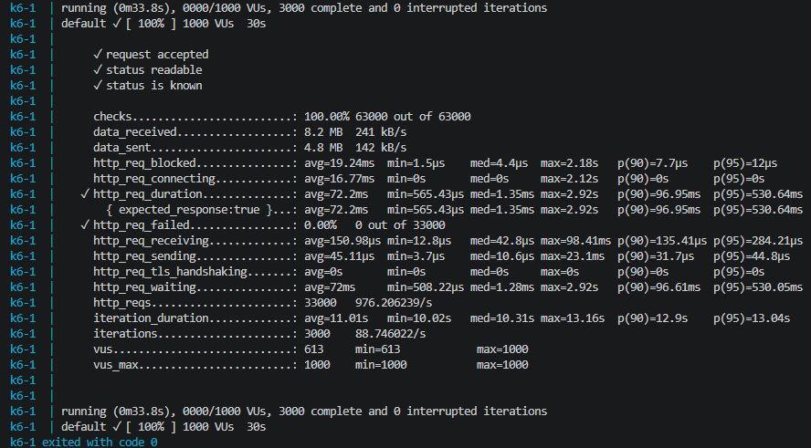

# Нагрузочное тестирование CrackHash

Основной сценарий теперь лежит в `load_tests/k6/crackhash.js` и запускается через Docker Compose. Метрики k6 пишутся в Prometheus remote write и видны в Grafana на dashboard `CrackHash Operations`.

## Быстрый запуск

```bash
docker compose --profile monitoring up --build -d
docker compose --profile monitoring --profile loadtest up k6
```

По умолчанию k6 использует профиль из `.env`:

```text
K6_VUS=1000
K6_DURATION=30s
K6_POLL_STATUS=true
K6_MAX_LENGTH=2
K6_HASH=25ed1bcb423b0b7200f485fc5ff71c8e
K6_SLEEP_SECONDS=1
```

`K6_HASH` выше это MD5 от `zz`, поэтому задача реально решаемая при `maxLength=2`, но достаточно лёгкая: нагрузка в основном идёт на manager, MongoDB outbox и RabbitMQ.

Скриншот итогового запуска с этими параметрами лежит в [`../screenshots/k6-test-results.png`](../screenshots/k6-test-results.png):



## Что именно нагружается

При `K6_POLL_STATUS=false` каждый виртуальный пользователь делает `POST /api/hash/crack`, получает `requestId`, ждёт `K6_SLEEP_SECONDS` и повторяет. Это manager-load тест: он показывает, как быстро manager принимает задачи, сохраняет их в MongoDB и публикует части в RabbitMQ.

При `K6_POLL_STATUS=true` каждый пользователь дополнительно polling-ит `GET /api/hash/status`. Это уже end-to-end тест клиента: больше HTTP-запросов, выше нагрузка на чтение из MongoDB, но меньше чистого давления на POST.

## Как менять нагрузку

PowerShell:

```powershell
$env:K6_VUS="300"; $env:K6_DURATION="1m"; docker compose --profile loadtest up k6
```

Bash:

```bash
K6_VUS=300 K6_DURATION=1m docker compose --profile loadtest up k6
```

1000 VU может быстро создать десятки тысяч задач. Если RabbitMQ queue depth растёт и долго не падает, это не баг теста: manager принимает быстрее, чем worker-ы успевают обработать backlog.

## Как читать результаты

В Grafana открыть `CrackHash Operations`:

- `Manager POST RPS` и `Request Rate`: сколько запросов реально принимает manager.
- `Manager Latency`: p95/p99 задержки POST. Если растёт, manager/MongoDB становятся узким местом.
- `RabbitMQ Queues`: `ready` это backlog, `unacked` это задачи, уже отданные worker-ам, но ещё не подтверждённые.
- `RabbitMQ Throughput`: скорость публикации и доставки сообщений.
- `Workers Alive`: сколько worker-инстансов сейчас scrape-ится Prometheus.
- `Mongo Replica Set Roles`: кто PRIMARY и кто SECONDARY.
- `Mongo Primary Count`: должно быть `1`.
- `Mongo Health`: по каждой MongoDB ноде должно быть `1`.
- `k6 Virtual Users`: сколько виртуальных пользователей было активно во время теста.

Если `RabbitMQ Queues` пустой, сначала проверить, что Prometheus target `rabbitmq-queues` в состоянии `UP`: `http://localhost:9090/targets`.
